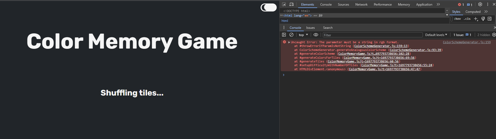

# Reflections Clean Code

## Chapter 2 - Meaningful Names

Throughout L2 and L3 I have tried to name my variables and methods as explicitly as possible. The names of the variables explain not only what they are conceptually, but also as primitive value, if this is needed (if the method is a helper method - Figure 1). The method names summarize what the method does and I tried to pick one word per concept. In the case of methods returning booleans, these start with "is" and when colors are returned, the method starts with "generate" (Figure 2). In order to get the luminance and contrast ratio, I used formulas so these methods start instead with "calculate". I tried to be mindful of what someone working in the industry might use as terminology this is why I used terms as "monochromatic", "analogous", "WCGAA" and "WCAGAAA" in my public interface in L2.

  
_Figure 1_

  
_Figure 2_

## Chapter 3 - Functions

I shortened my functions and tried not to repeat myself, but I did not follow the rules of Clean Code strictly all the time. Figure 3 and 4 represent before and after in L3, where I had the methods do one thing and keep one level of indentation. In my opinion it is more readable, but it would not be something I write to begin with because I am not used to this way of structuring my thoughts. When I think of a next step, I do not think of a new method, but rather a new line of code. The way that is suggested by CC (Figure 4) implies more lines of code, but less comments because the method names are more explicit. This could be a suitable trade-off assuming the programmer is used to this way of thinking. I also had to make some compromise and parameterize the method isTileColorCorrect (Figure 4) in order not to have several levels of indentation and logic nested in the same method. So I think the book contradicts itself and in the real world, it is not always possible to have perfectly "clean" code.

  
_Figure 3 - Before_

  
_Figure 4 - After_

## Chapter 4 - Comments

After the experiment in Figure 3 and 4 I am coming to the realization that writing self explanatory code does not require the use of comments. Usually when I do a revision to my project I tend to skip updating the comments, but rather use the comments to understand my old code, which according to CC shouldn't be necessary if you write clear code. Some of my comments were redundant and could be removed by splitting the code into several methods that have intention revealing names. Other comments explained the intention behind a behavior (like in the case of using formulas for calculating luminance or color theory - Figure 5 and Figure 6).  
Figure 7 shows an unnecessary comment that I removed, and instead used a variable name that was more explicit (Figure 8). The variable also stays close to where it is used, so it is easier to understand the context.  
Other things I will consider in the future would be to not add redundant comments, that restate the obvious (method name in sentence form), although these have been indoctrinated in myself by the courses so far. In my opinion either all methods have a comment or none of them do. To do comments are still useful, and mark what needs to be done in the future, what does not work yet, or what is a temporary solution. It's easy to search through the project for them, in the case of a hiatus from the project. I tend to write longer comments at first, to give myself pointers or even paste the problem inside my project with comments. But after that I try to shorten them and make them more concise, so that they can be a helper to both myself and others who might read my code.

  
_Figure 5_

  
_Figure 6_

  
_Figure 7_

  
_Figure 8_

## Chapter 5 - Formatting

In L2 and L3 I have the most important concepts at the top and least important at the bottom, with helper methods underneath the methods that call them (Figure 9).
Empty lines separate concepts that are not related if the method does more than one thing.

Instance variables, that are used by many methods in the class, are at the top of the class. Otherwise if they are only used inside one method they are declared inside that method so that they are relevant to the context they are being used in (Figure 10).

Inside my projects, lines are no longer than 80 characters (due to prettier) and there are usually around 200 lines in one file, to keep the code readable and maintainable.

Formatting is done the same style using prettier. In both L2 and L3, the same line length, same indentation and same spacing is used throughout the project.

  
_Figure 9_

  
_Figure 10_

## Chapter 6 - Objects and Data Structures

In L2 and L3 I use no unnecessary getters and setters. The ThemeSwitcher class from L3 has a getter for the current theme, but no setter. ThemeSwitcher is an object, in the sense that it hides its methods and only provides access to its attribute of "current theme". In L3's "ColorMemoryGame" only the method to start the game is public, the rest are private. The class is an object, because it hides its methods and only provides access to the method "initiateGame". The ColorMemoryGame uses a ThemeSwitcher object in its constructor to generate colors/change theme according to the ThemeSwitcher's current theme.

  
_Figure 11_

L2's classes are necessarily "exposing" more methods because the project is a module offering functionality related to colors. But they are still objects because they don't expose attributes, only methods.

All of the classes respect the law of Demeter and do not call methods on objects that were returned by calling methods on other objects.

## Chapter 7 - Error Handling

If the error handling code is mixed with the main logic, it is harder to read and understand the main logic. In both of the projects I throw exceptions only when really necessary. Because L3 doesn't really have ways users can input malicious things or do wrong in the sense of using the application, I do not throw errors, as to not clutter my program. I instead test as I develop and see if any problems with the program occur.
One occasion where I throw an error is when the user tries to enter an empty username. There I throw an error and the user is prompted to enter a username by creating a warning message. 

Following this I do not return null or pass in object that may be null in any circumstance. The methods from my module (L2) return a result if used correctly. For this I am throwing an error if the user tries to pass in a color that is not in right rgb format, in order to generate a color scheme. The error is treated as one thing and has its own method. (Figure 12)

  
_Figure 12_

The developer will then get the error in the console, look up the stack-trace, and will hopefully be wiser than pushing the code into production. (Figure 13)

  
_Figure 13_

## Chapter 8 - Boundaries

No external API's were used in L2 or L3, both use only the JS standard library. L2 is a module that was manually tested and L3 is a web application that builds on top of L2. L3 was also manually tested. Furthermore I wrote the code for the module L2 so I understand its inner-workings. I did however think about how users may make mistakes when using it, therefore the error handling in Figure 12.

I did not overexpose parts of my modules to other modules. In L2 the modules work separately from each other, even though the the colors generated with ColorGenerator can be used in ColorSchemeGenerator or FontColorHelper, this is not a must (rgb strings can be passed in as arguments as well). In L3 the ThemeSwitcher is used in the ColorMemoryGame, but the ColorMemoryGame does not have access to the ThemeSwitcher's methods, only to its current theme. (Figure 11)

In a sense the code from both projects has clean boundaries because it is not dependent on anything external. However, more cases for misuse could be thought of and handled. For example, in L3 the user could try to change the theme before the game has started, or try to change the theme to a theme that does not exist. (Figure 14)

  
_Figure 14_

## Chapter 9 - Unit Tests

In both L2 and L3 I conducted manual tests. I took the requirements and conducted at least a test for each.  
In L2 I tested every method in the public interface. Tests were conducted on one thing at a time and had specific steps to follow (Figure 17). For L2 I wrote a very simple application that sets colors to HTML elements. Perhaps a better method here would have been automatic testing, given the fact that I used a visual assessment to decide if the colors where of a certain lightness, if the color themes were monochromatic or analogous, or if the font matched.  

  
_Figure 17_

For L3 I provided a table with input, expected result and actual result. Here it was more appropriate to conduct the tests using the application itself and see if it works as intended. Most of the testing happened naturally as I was writing the code. Even though I did not use any testing frameworks, I did use the 5 principles of testing: Fast, Independent, Repeatable, Self-Validating, Timely.  

FIRST - Fast, Independent, Repeatable, Self-Validating, Timely.
Tests were not depended on each other and easily repeatable following the steps I provided. In the case of manual testing, the tests were not fast, or self-validating, I had to judge the results myself and compare them to the expected results. The tests were repeatable because I provided step by step instructions on how I conducted them. The tests were timely, because I conducted them as I was developing the application.

## Chapter 10 - Classes

The class organization is as following: attributes at the top, public methods after that and private methods at the bottom. If a method uses several private methods, these are grouped together and come after the method that uses them. (Figure 15)

  
_Figure 15_

 The classes in L3 and L3 are encapsulated by hiding their implementation details from other classes - having most methods private and only exposing the public interface. L2 has a larger public interface because it is a module that offers functionality to other applications. L3 is a web application that uses the module L2, so it only exposes the start method ("initiateGame").

Admittedly, the ColorMemoryGame class has about 300 lines of code and is not small. The class is also not very cohesive because the methods do not use all instance variables. It could be split into smaller classes (DOM manipulation, game logic, error handling), but I think it is not necessary because the application is not yet extensive in its functionality and it is easier for me to understand the code when it is all in one place. If the application were to grow, I would  consider splitting the class into smaller classes.

The classes in L2 respect the SRP to a greater extent, respectively generating colors, color schemes and handling font colors. This was easier to achieve when no application logic was involved.

## Chapter 11 - Systems

Separation of construction and use - the main method in ColorMemoryGame is not in the same class as the class that is being used. The main method is in the index.js file and the classes are in their own files.

Dependency injection is not abused, I only used it in the ColorMemoryGame class to inject the current theme from ThemeSwitcher. (Figure 16)

  
_Figure 16_

The module's classes are not tightly coupled, because they do not depend on each other. The module is a collection of functions that can be used separately from each other. 

Separation of concerns - different parts of the system should be concerned with different things. As stated before, the class with most problems would be the ColorMemoryGame class, because it is not very cohesive and should be refactored as the application grows. The other classes are more cohesive and have a clear purpose.